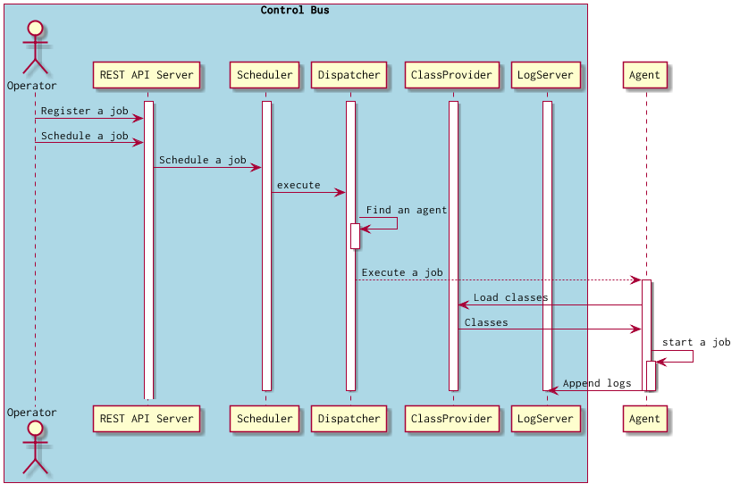

# JobStreamer control bus

The JobStreamer control bus is a message passing system to agents.



## Features

* Deploy a batch application. (And parse JavaBatch components from application classpath)
* Register a job.
* Delete a job.
* Update a job.

* Schedule a job.
* Stop a schedule of job.
* Delete a schedule of job.

## For Developers

[Duct framework](https://github.com/duct-framework/duct) is used in the JobStreamer control bus.

Run a REPL and start a control bus as follows:

```
% lein repl
Clojure 1.8.0
Java HotSpot(TM) 64-Bit Server VM 1.8.0_92-b14
    Docs: (doc function-name-here)
          (find-doc "part-of-name-here")
  Source: (source function-name-here)
 Javadoc: (javadoc java-object-or-class-here)
    Exit: Control+D or (exit) or (quit)
 Results: Stored in vars *1, *2, *3, an exception in *e

user=> (dev)
:loaded
user=> (go)
```

## API

### Create a appliccation

```
POST /apps
```

#### Example

```clojure
{
  :name "batch-example"
  :description "Batch example"
  :classpath [
    "file:///home/app/target/classes"
    "file:///var/m2/repository/xxx/xxx.jar"
    "file:///var/m2/repository/yyy/yyy.jar"
    "file:///var/m2/repository/zzz/zzz.jar"
  ]
}
```

`NOTICE`

> Currently, JobStreamer supports only single application.

### List jobs

```
GET /:app-name/jobs
```

#### Response

```clojure
[
  {
    :job/id           "JOB-1"
    :job/restartable? true
  }
]
```

### Create a job

```
POST /:app-name/jobs
```

#### Parameters

|Name|Type|Description|
|----|----|-----------|
|id|String|Required. The identity of the job.|

#### Example

```clojure
{
  :id "JOB-1"
  :steps [
    {
      :id "STEP-1"
      :batchlet {
        :ref "example.Batchlet"
      }
    }
  ]
}
```

### Get a single job

```
GET /:app-name/job/:job-name
```

#### Response

```clojure
{
  :db/id 17592186045451
  :job/stats {
    :total 49
    :success 39
    :failure 3
    :average 2660/39
  }
  :job/schedule {
    :schedule/active? true
    :schedule/cron-notation "0 0 * * * ?"
  }
  :job/restartable? true
  :job/name "MyShell"
  :job/next-execution {
    :job-execution/start-time #inst "2015-04-13T09:00:00.000-00:00"
  }
  :job/latest-execution {
    :job-execution/batch-status {:db/ident :batch-status/queued}
    :job-execution/create-time #inst "2015-04-13T07:00:00.006-00:00"
  }
}
```

### Update a job

```
PUT /:app-name/job/:job-name
```

#### Inputs

|Name|Type|Description|
|----|----|-----------|
|id|String|Required. The identity of the job.|

### Delete a job

```
DELETE /:app-name/job/:job-name
```

### Schedule a job

```
POST /:app-name/job/:job-name/schedule
```

#### Input

|Name|Type|Description|
|----|----|-----------|
|job/name|String|Required. A job name|
|schedule/cron-notation|String|Required. A schedule by the cron notation.|

```clojure
{
 :job/name "MyShell"
 :schedule/cron-notation "0 0 * * * ?"
}
```

### Execute a job

```
POST /:app-name/job/:job-name/executions
```

### List executions

```
GET /:app-name/job/:job-name/executions
```

#### Response

```clojure
[
  {
    :db/id 17592186045455
    :job-execution/execution-id 119
    :job-execution/create-time #inst "2015-04-08T04:54:15.703-00:00"
    :job-execution/start-time #inst "2015-04-08T04:55:01.694-00:00"
    :job-execution/end-time #inst "2015-04-08T04:55:01.796-00:00"
    :job-execution/agent {
      :agent/name "agent-1"
      :agent/instance-id #uuid "5424c784-a145-4d3e-96f3-b9d99858611a"
    }
    :job-execution/batch-status {:db/ident :batch-status/completed}
    :job-execution/job-parameters "{}"
  }
]
```

### Get a single execution

```
GET /:app-name/job/:job-name/execution/:execution-id
```

### List agents

```
GET /agents
```

#### Response

```clojure

```

### Get a single agent

```
GET /agent/:instance-id
```

#### Response

```clojure
{
  :agent/name "agent-1"
  :agent/port 4510
  :agent/jobs {:running 0}
  :command :ready
  :agent/instance-id #uuid "d7dd0172-d272-41a4-aad2-56318b2234ee"
  :agent/cpu-arch "amd64"
  :agent/cpu-core 4
  :agent/os-name "Linux"
  :agent/stats {
    :memory {
      :physical {
        :free 1070014464
        :total 8281976832
      }
      :swap {
        :free 34325999616
        :total 34359734272
      }
    }
    :cpu {
      :process {
        :load 0.024032586558044806
        :time 13050000000
      }
      :system {
        :load 0.07780040733197556
        :load-average 2.43
      }
    }
  }
  :agent/os-version "3.19.3-3-ARCH"
  :agent/host "127.0.0.1"
  :agent/executions []
}
```

### Get statistics of control bus

```
GET /:app-name/stats
```

#### Response

```clojure
{:agents 0, :jobs 3}
```
